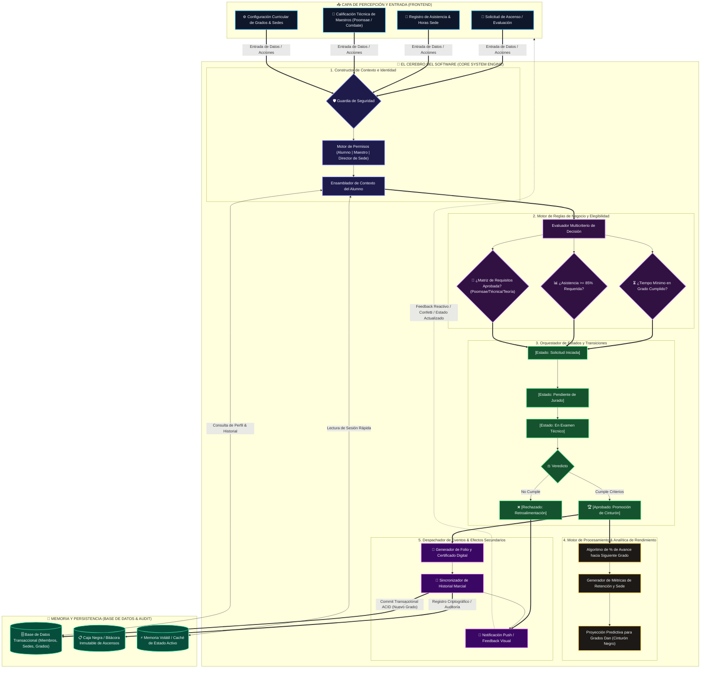

# 🧠 Arquitectura del Cerebro del Software (Core Engine & Decision System)

> **Proyecto de Grado**  
> *Modelo Conceptual y Operativo del Motor Central de Negocio, Decisión y Evaluación*

---

## 1. Diagrama de Flujo: El "Cerebro" del Software en Obsidian

---

## 2. Argumentación Académica para la Sustentación

Ante el tribunal o jurado evaluador, defender el **"Cerebro del Software"** demuestra que el sistema no es un simple CRUD de base de datos, sino una **arquitectura inteligente orientada al dominio (Domain-Driven Design)**.

### A. Submódulo 1: Ingestión y Constructor de Contexto
- **Propósito:** Ninguna decisión se toma con datos aislados. El constructor de contexto toma la solicitud del usuario, valida su identidad criptográfica (JWT) y reconstruye su estado actual (antigüedad, rol y sede asignada).
- **Justificación:** Protege la integridad del sistema impidiendo que clientes maliciosos manipulen parámetros locales.

### B. Submódulo 2: Motor de Reglas de Negocio (Rule Engine)
- **Patrón utilizado:** *Specification Pattern / Rules Engine*.
- **Lógica:** Desacopla las condiciones de aprobación en evaluadores atómicos:
  1. Verificación temporal de permanencia mínima en grado.
  2. Verificación de asistencia física/disciplinar (mínimo 85%).
  3. Matriz de competencias técnicas (Poomsae, Kyorugi/Combate, Teoría marcial).

### C. Submódulo 3: Máquina de Estados Finitos (Workflow State Machine)
- **Propósito:** El ascenso de un alumno no es una modificación directa en la base de datos; es un **proceso formal con estados finitos deterministas**:
  $$\text{Iniciada} \rightarrow \text{Pendiente} \rightarrow \text{Evaluación Técnica} \rightarrow \{\text{Aprobada} \mid \text{Rechazada}\}$$
- **Beneficio Académico:** Elimina inconsistencias, estados intermedios inválidos y garantiza que ningún grado sea otorgado sin la intervención explícita del jurado evaluador.

### D. Submódulo 4: Motor Analítico y Métricas
- **Propósito:** Calcula dinámicamente el porcentaje de avance, la tasa de deserción por grado y la proyección de graduación a cinturón negro (Grados Dan).

### E. Submódulo 5: Despachador de Eventos (Event-Driven Architecture)
- **Efectos secundarios atómicos:** Tras la aprobación, el cerebro dispara de forma asíncrona:
  1. Emisión del folio único del certificado.
  2. Registro inmutable en la bitácora de auditoría.
  3. Notificación reactiva inmediata hacia la interfaz de usuario.
