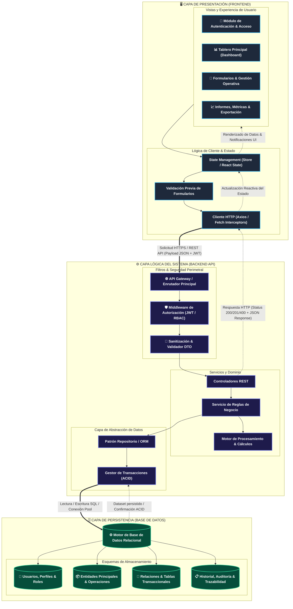

# 📐 Diagrama de Arquitectura y Flujo de Información

> **Proyecto de Grado**  
> *Arquitectura de Software en Capas: Frontend, Backend y Persistencia*

---

## 1. Diagrama de Flujo del Sistema

---

## 2. Guía de Sustentación Académica

### A. Capa de Presentación (Frontend)
- **Desacoplamiento visual:** Las vistas (`UI_VIEWS`) no se comunican directamente con el servidor.
- **Manejo de Estado Centralizado:** Toda interacción pasa por un gestor de estado (`STATE`) que controla el ciclo de vida de los datos antes de cualquier petición.
- **Validación Temprana:** Se valida en cliente para ahorrar ancho de banda y mitigar peticiones erróneas antes de salir a la red.

### B. Canal Seguro de Transporte
- **Cifrado y Autenticación:** Protocolo HTTPS seguro transportando payloads en formato JSON junto con tokens de sesión (JWT) en encabezados de autorización.

### C. Capa Lógica y Procesamiento (Backend)
- **Seguridad Perimetral:** El `API Gateway` filtra mediante middlewares de autenticación y autorización basada en roles (RBAC).
- **Sanitización DTO:** Se limpia y valida cada parámetro de entrada para evitar inyecciones y datos anómalos.
- **Capa de Dominio & Servicios:** La lógica de negocio está aislada de los controladores, manteniendo alta cohesión y bajo acoplamiento.
- **Abstracción ORM / Transacciones ACID:** Las operaciones atómicas garantizan consistencia y aislamiento en todo momento.

### D. Capa de Persistencia (Base de Datos)
- **Normalización y Estructura:** Modelado relacional organizado en entidades de usuarios/roles, lógica transaccional de negocio y logs de auditoría para trazabilidad.

### E. Ciclo de Retorno Reactivo
- Las líneas discontinuas representan la respuesta: confirmación de la base de datos $\rightarrow$ código de estado HTTP adecuado $\rightarrow$ cliente HTTP $\rightarrow$ actualización reactiva de la interfaz con notificación visual instantánea al usuario.
