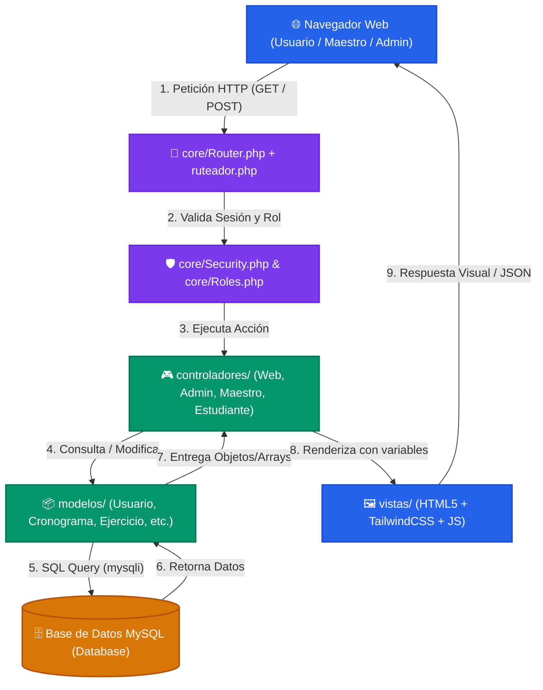

# 🥋 Jinhwan Corporation - Guía Maestra del Sistema

Bienvenido a la documentación oficial e interactiva del software **Jinhwan Corporation**. Este espacio está diseñado para leerse cómodamente tanto en **Obsidian** (con soporte nativo para diagramas visuales y enlaces internos) como en cualquier visor de Markdown.

---

## 🗺️ Mapa Visual de la Arquitectura

---

## 📚 Índice de Capítulos

Haz clic en cualquier enlace para ir al tema correspondiente:

| N° | Capítulo | ¿Qué aprenderás aquí? |
|---|---|---|
| **01** | [[01_ESTRUCTURA_Y_CARPETAS\|Estructura y Carpetas]] | Para qué sirve cada carpeta del proyecto y sus archivos raíz. |
| **02** | [[02_ENRUTAMIENTO_Y_DESPACHO\|Enrutamiento y Despacho]] | Cómo viaja una URL desde `Router.php` hasta el controlador exacto. |
| **03** | [[03_COMUNICACION_ENTRE_LENGUAJES\|Comunicación entre Lenguajes]] | Cómo dialogan PHP, JavaScript (AJAX/Fetch/JSON), MySQL y HTML/CSS. |
| **04** | [[04_BASE_DE_DATOS_Y_RELACIONES\|Base de Datos y Relaciones]] | Esquema de tablas, llaves primarias, foráneas y su significado. |
| **05** | [[05_ROLES_PERMISOS_Y_SEGURIDAD\|Roles, Permisos y Seguridad]] | Protección de rutas, control de sesiones por inactividad y hash de claves. |
| **06** | [[06_CONTROLADORES_Y_MODELOS\|Controladores y Modelos]] | Directorio detallado de cada controlador y modelo por módulo. |
| **07** | [[07_CASOS_DE_USO_PASO_A_PASO\|Casos de Uso Paso a Paso]] | El viaje completo de una petición real (Login, Calificar, Cronograma). |
| **08** | [[08_ARCHIVOS_ALERTAS_Y_ENTORNOS\|Archivos, Alertas y Entornos]] | Subida de archivos, alertas con SweetAlert2, Laragon vs Hosting y cómo agregar funciones. |

---

> 💡 **Tip para Obsidian:** Activa la vista de grafo (*Graph View*) para visualizar cómo todos los capítulos y módulos se conectan dinámicamente entre sí.
