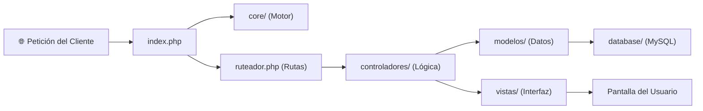

# 📁 01 - Estructura del Software y Carpetas

Este capítulo describe para qué sirve cada carpeta y cada archivo en la raíz del proyecto **Jinhwan Corporation**.

---

## 🏛️ Árbol General de Directorios

```text
c:\laragon\www\jinwha\
├── config/             # Configuración de base de datos y entorno
├── controladores/      # Controladores MVC agrupados por rol/módulo
│   ├── Administracion/ # Gestión total del sistema (alumnos, sedes, teorías)
│   ├── Autenticacion/  # Login, logout y registro
│   ├── Estudiante/     # Portal del deportista (estudio, historial, avance)
│   ├── Maestro/        # Portal del instructor (cronogramas, ejercicios)
│   ├── Usuario/        # Configuración común (perfil, calendario propio)
│   └── Web/            # Portal público visible sin iniciar sesión
├── core/               # Núcleo del framework MVC propio (Router, Security, Model, Controller)
├── database/           # Scripts SQL y esquemas de la base de datos
├── docs/               # Documentación general y manuales para Obsidian
├── helpers/            # Funciones auxiliares globales (URL helpers, sanitización)
├── modelos/            # Clases que interactúan directamente con la base de datos
├── public/             # Recursos estáticos servidos públicamente (CSS, JS, imágenes)
├── resources/          # Archivos de diseño fuente, plantillas o assets crudos
├── scripts/            # Scripts utilitarios auxiliares
├── storage/            # Subida de fotos, certificados y archivos del sistema
├── vistas/             # Plantillas PHP que se muestran en el navegador
│   ├── administracion/ # Vistas del panel de control de administrador
│   ├── autenticacion/  # Formularios de login y registro
│   ├── estudiante/     # Vistas del estudiante / deportista
│   ├── layout/         # Encabezados, barras de navegación y pies de página compartidos
│   ├── maestro/        # Vistas de cronogramas y ejercicios para profesores
│   ├── usuario/        # Vistas de perfil y configuración general
│   └── web/            # Páginas institucionales (inicio, sedes, galería)
├── index.php           # Punto de entrada único a toda la aplicación
├── ruteador.php        # Registro y vinculación de todas las rutas HTTP
├── .htaccess           # Redirección de URLs amigables hacia index.php (Apache)
├── package.json        # Dependencias de NodeJS (Tailwind, Vite, Chart.js)
└── vite.config.ts      # Configuración del compilador de frontend Vite
```

---

## 📄 Explicación de los Archivos Clave en la Raíz

| Archivo | Propósito | ¿Cuándo se ejecuta? |
|---|---|---|
| `index.php` | **Punto de Entrada Universal**. Inicializa la sesión, carga la configuración de base de datos, los componentes de `core/` y finalmente llama a `ruteador.php`. | En **absolutamente cada clic o petición** que hace el usuario en el navegador. |
| `ruteador.php` | **Diccionario de Rutas**. Contiene la lista de todas las URLs disponibles (`/login`, `/admin/estudiantes`, etc.) y define qué método de qué controlador se debe disparar. | Inmediatamente después de cargar `index.php`. |
| `.htaccess` | **Reescritura de Apache**. Oculta `index.php` de la barra de direcciones para que las URLs sean limpias (ej. `/nosotros` en vez de `/index.php?url=nosotros`). | A nivel de servidor web Laragon/Apache antes de que PHP reciba la llamada. |
| `package.json` | **Gestor de Paquetes JS**. Administra librerías como TailwindCSS, Chart.js y Canvas Confetti para el diseño moderno. | Solo cuando compilas el frontend con `npm run build` o ejecutas `npm run dev`. |
| `vite.config.ts` | **Configurador de Vite**. Define cómo compilar TypeScript y Tailwind hacia la carpeta pública. | En tiempo de desarrollo frontend. |

---

## 🧩 Relación entre Carpetas Fundamentales



Siguiente capítulo: [[02_ENRUTAMIENTO_Y_DESPACHO|02 - Enrutamiento y Despacho]].
