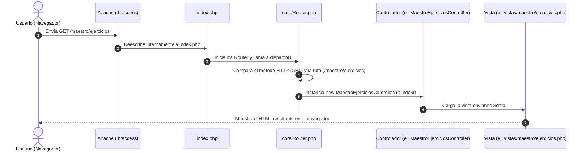

# 🔀 02 - Enrutamiento y Despacho de Peticiones

En este capítulo aprenderás cómo viaja una petición desde que el usuario escribe una URL o envía un formulario hasta que se ejecuta el código en PHP.

---

## 🧭 ¿Qué es el Enrutador y cómo funciona?

El software utiliza un patrón llamado **Front Controller** (Controlador Frontal). Esto significa que **todas las peticiones entran por un único archivo (`index.php`)** y luego la clase `Router` decide a quién delegarle el trabajo.



---

## 🛠️ Métodos de Envío Soportados

El sistema soporta principalmente dos métodos HTTP:

### 1. Peticiones GET
- **Propósito:** Solicitar y mostrar información sin alterar la base de datos.
- **Ejemplo en `ruteador.php`:**
  ```php
  $router->get('/maestro/alumnos', [MaestroAlumnosController::class, 'index']);
  ```
- **Rutas con Parámetros Dinámicos (`{id}`):**
  El enrutador detecta llaves como `{id}` usando expresiones regulares:
  ```php
  $router->get('/maestro/alumnos/{id}', [MaestroAlumnosController::class, 'show']);
  ```
  Si el usuario visita `/maestro/alumnos/15`, el enrutador extrae `15` y lo pasa automáticamente como argumento: `show(15)`.

### 2. Peticiones POST
- **Propósito:** Enviar datos de formularios, crear, actualizar o eliminar registros de manera segura.
- **Ejemplo en `ruteador.php`:**
  ```php
  $router->post('/maestro/ejercicios/create', [MaestroEjerciciosController::class, 'store']);
  ```

---

## 🔍 Desglose del archivo `core/Router.php`

El archivo `core/Router.php` realiza 4 pasos indispensables en su método `dispatch()`:

1. **Obtener el método y la ruta limpia:**
   ```php
   $method = $_SERVER['REQUEST_METHOD']; // 'GET' o 'POST'
   $path = parse_url($_SERVER['REQUEST_URI'], PHP_URL_PATH);
   ```
2. **Normalizar el subdirectorio de Laragon:**  
   Si el proyecto está en `localhost/jinwha/`, descuenta el prefijo `/jinwha` para que la ruta interna siempre empiece en `/`.
3. **Buscar coincidencia exacta:**  
   Si `$this->routes['GET']['/inicio']` existe, ejecuta la función asociada.
4. **Evaluar parámetros dinámicos con Regex:**  
   Si la ruta tiene `{id}`, reemplaza `{id}` por `([^/]+)` para capturar valores variables de la URL.
5. **Manejo de Error 404:**  
   Si ninguna ruta coincide, emite el código HTTP 404 (`404 Not Found`).

---

Siguiente capítulo: [[03_COMUNICACION_ENTRE_LENGUAJES|03 - Comunicación entre Lenguajes]].
