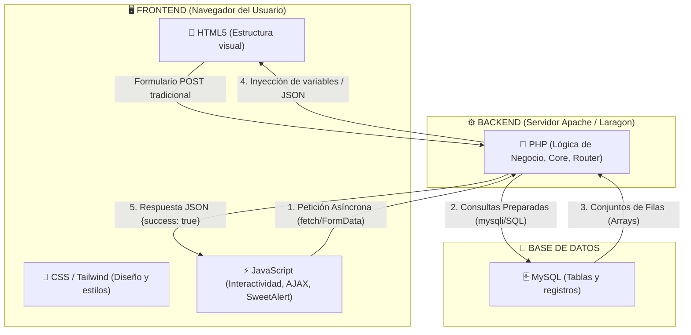

# 💬 03 - Comunicación entre Lenguajes de Programación

En un sistema web moderno como **Jinhwan Corporation**, conviven varios lenguajes. Este capítulo explica exactamente cómo dialogan y se transfieren datos entre sí.

---

## 🔄 El Puente de los Lenguajes



---

## 1. JavaScript ⇄ PHP (AJAX y JSON)

Cuando no queremos recargar toda la página (por ejemplo al agregar un evento en el calendario o cambiar la visibilidad de un perfil):

1. **JavaScript envía datos hacia PHP:**  
   Utiliza la API moderna `fetch()` enviando una petición POST con los datos:
   ```javascript
   fetch('/admin/calendario/create', {
       method: 'POST',
       headers: { 'Content-Type': 'application/json' },
       body: JSON.stringify({
           titulo: 'Torneo Nacional',
           fecha: '2026-10-15'
       })
   })
   .then(response => response.json())
   .then(data => {
       if(data.success) {
           Swal.fire('¡Éxito!', 'Evento creado correctamente', 'success');
       }
   });
   ```

2. **PHP recibe y responde a JavaScript:**  
   En el controlador correspondiente, PHP procesa la solicitud y devuelve un string codificado en formato JSON:
   ```php
   // En el controlador PHP:
   header('Content-Type: application/json');
   echo json_encode([
       'success' => true,
       'mensaje' => 'Evento guardado con éxito'
   ]);
   exit;
   ```

---

## 2. PHP ⇄ MySQL (Consultas SQL)

Para guardar y consultar datos:

1. **PHP abre la conexión:**  
   Mediante la clase singleton `Database::getInstance()->getConnection()`, PHP mantiene un enlace activo vía la librería nativa `mysqli`.
2. **Envío de Consultas Seguras:**  
   Los modelos ejecutan sentencias preparadas o consultas directas sanitizadas:
   ```php
   $query = "SELECT * FROM estudiante WHERE id = " . intval($id);
   $resultado = $this->db->query($query);
   $estudiante = $resultado->fetch_assoc(); // Convierte la fila SQL en un array asociativo PHP
   ```

---

## 3. PHP ⇄ HTML/CSS (Renderizado de Vistas)

¿Cómo llegan las variables calculadas en PHP a la pantalla que ve el usuario?

1. El controlador invoca el método base `view('maestro/alumnos', $data)`:
   ```php
   $alumnos = $modeloUsuario->obtenerAlumnos();
   $this->view('maestro/alumnos', ['alumnos' => $alumnos, 'titulo' => 'Mis Alumnos']);
   ```
2. La función `extract($data)` convierte las claves del array en variables directas de PHP (`$alumnos` y `$titulo`).
3. El archivo de vista en `vistas/maestro/alumnos.php` las imprime limpiamente dentro del código HTML:
   ```php
   <h1 class="text-2xl font-bold text-gray-800"><?= htmlspecialchars($titulo) ?></h1>
   <?php foreach ($alumnos as $alumno): ?>
       <div class="tarjeta-alumno">
           <p><?= htmlspecialchars($alumno['nombre']) ?></p>
       </div>
   <?php endforeach; ?>
   ```

---

Siguiente capítulo: [[04_BASE_DE_DATOS_Y_RELACIONES|04 - Base de Datos y Relaciones]].
