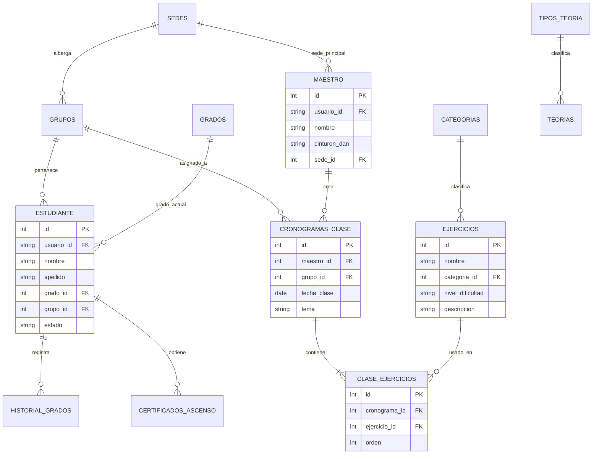

# 🗄️ 04 - Base de Datos y Relaciones

El sistema opera sobre una base de datos relacional MySQL llamada `if0_42216592_jinhwa_corporation`. Este capítulo presenta el diagrama entidad-relación y la explicación de cada tabla.

---

## 📊 Diagrama Entidad-Relación (ER)

---

## 📋 Catálogo de Tablas Principales

| Tabla | Función en el Sistema |
|---|---|
| `administrador` | Cuentas de superusuario con permisos globales de gestión. |
| `maestro` | Perfiles de instructores, cinturones Dan y vinculación de sedes. |
| `estudiante` | Expediente completo del alumno (asistencias, grupo, grado, estado activo/inactivo). |
| `grados` | Tabla maestra de cinturones (Blanco, Amarillo, Verde, Azul, Rojo, Negro). |
| `historial_grados` | Bitácora temporal de fechas en que el estudiante ascendió de grado. |
| `certificados_ascenso`| Registros formales de certificados emitidos y folios únicos. |
| `sedes` | Escuelas y dojos físicos afiliados a la corporación. |
| `grupos` | Clases y horarios por edad/nivel (ej. Infantiles, Juveniles, Adultos). |
| `cronogramas_clase` | Planes de clase creados por maestros para una fecha y grupo específico. |
| `ejercicios` | Biblioteca de técnicas, patadas, formas (Poomsae) y combates. |
| `clase_ejercicios` | Tabla pivote que une los ejercicios que se practicarán en un cronograma. |
| `teorias` | Material didáctico, historia, filosofía y reglas del Taekwondo. |
| `tipos_teoria` | Clasificaciones del material teórico (Historia, Filosofía, Terminología). |
| `eventos` | Torneos, seminarios y exámenes para el calendario institucional. |
| `galeria_multimedia` | Fotos y videos de eventos institucionales. |

---

## 🔗 Claves Foráneas y Reglas de Integridad

- **Integridad de Alumnos:** Si un alumno pertenece a un `grupo_id`, no puede eliminarse el grupo sin antes reasignar o desvincular al estudiante.
- **Trazabilidad de Ascensos:** Cada vez que la administración aprueba una solicitud de ascenso, se crea un registro en `historial_grados` y se genera un folio en `certificados_ascenso`.

---

Siguiente capítulo: [[05_ROLES_PERMISOS_Y_SEGURIDAD|05 - Roles, Permisos y Seguridad]].
