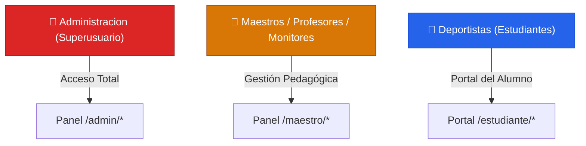

# 🛡️ 05 - Roles, Permisos y Seguridad

La seguridad del sistema está centralizada en dos clases del núcleo: `core/Security.php` y `core/Roles.php`. Este capítulo detalla cómo el sistema blinda las rutas y protege la información.

---

## 👥 Jerarquía de Roles (`core/Roles.php`)

El sistema clasifica a los usuarios en 5 roles bien diferenciados:



| Constante | Valor en DB | Alcance de Permisos |
|---|---|---|
| `ADMINISTRADOR` | `'Administracion'` | Control total: gestión de sedes, miembros, teorías, reportes y configuración. |
| `MAESTRO` | `'Maestros'` | Creación de cronogramas, biblioteca de ejercicios y seguimiento de alumnos. |
| `PROFESOR` | `'Profesores'` | Instrucción y evaluación en dojos específicos. |
| `MONITOR` | `'Monitores'` | Apoyo a maestros en el seguimiento de entrenamientos. |
| `ESTUDIANTE` | `'Deportistas'` | Consulta de material de estudio, avances, asistencias y certificados. |

---

## 🔒 Mecanismos de Seguridad (`core/Security.php`)

El archivo `Security.php` aplica múltiples capas de protección activas:

### 1. Control de Inactividad (Timeout de Sesión)
- Si un usuario pasa más de **30 minutos (1800 segundos)** sin realizar ninguna acción, el sistema destruye la sesión y lo redirige al login con el mensaje `?error=timeout`.

### 2. Prevención de Robo de Sesión (Session Hijacking)
- **Validación de Navegador:** En el inicio de sesión se guarda el `HTTP_USER_AGENT`. Si una petición posterior llega con una firma de navegador distinta para la misma cookie, se anula inmediatamente (`?error=security`).
- **Regeneración de ID:** Cada 30 minutos se fuerza `session_regenerate_id(true)`, impidiendo que un identificador de sesión interceptado sea reutilizable de por vida.

### 3. Tiempo de Vida Máximo
- Ninguna sesión puede durar más de **8 horas continuas (28800 segundos)**. Al cumplirse este lapso, se solicita reautenticación por caducidad.

### 4. Verificación de Accesos en Controladores
Cada controlador protegido inicia validando el rol del usuario:
```php
// Solo administradores pueden entrar
Security::verifyAdmin();

// Solo maestros o monitores pueden entrar
Security::verifyMaestro();

// Validación por permiso granular (JSON)
Security::verifyPermission('crear_eventos');
```

---

## 🛡️ Recomendaciones de Buenas Prácticas

1. **Consultas Preparadas:** Utilizar siempre parámetros enlazados en `$this->db->prepare()` para evitar inyecciones SQL.
2. **Hash de Contraseñas:** Usar la función nativa de PHP `password_hash($clave, PASSWORD_BCRYPT)` y validar con `password_verify()`.
3. **Escape de Salidas en Vistas:** Envolver cualquier dato que provenga de la base de datos o de formularios en `htmlspecialchars($variable, ENT_QUOTES, 'UTF-8')` para evitar ataques Cross-Site Scripting (XSS).

---

Siguiente capítulo: [[06_CONTROLADORES_Y_MODELOS|06 - Controladores y Modelos]].
