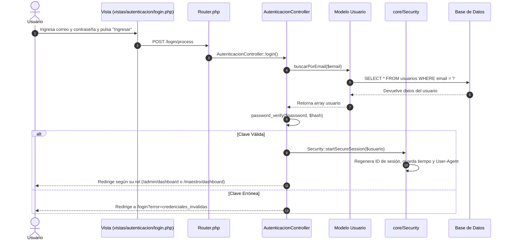

# 🎬 07 - Casos de Uso Paso a Paso

Para comprender cómo encajan todas las piezas, este capítulo recorre paso a paso 3 de los procesos más importantes del sistema.

---

## Caso 1: Inicio de Sesión (Login)

---

## Caso 2: Un Maestro Diseña un Cronograma de Clase

1. **Entrada al módulo:**  
   El maestro visita `/maestro/cronogramas` (Ruta GET atendida por `MaestroCronogramasController::index`).
2. **Creación del encabezado:**  
   Completa el formulario modal indicando la fecha, el grupo destinatario y el tema central de la clase.
3. **Envío POST:**  
   El formulario dispara un `POST /maestro/cronogramas/create`. El controlador valida que el usuario sea maestro, inserta el registro en la tabla `cronogramas_clase` y obtiene el `id` recién generado.
4. **Asignación de Técnicas:**  
   El maestro es redirigido a `/maestro/cronogramas/{id}`. Desde allí selecciona ejercicios de su biblioteca técnica (patada Dollyo Chagi, Poomsae Taegeuk Il Jang).
5. **Petición Asíncrona:**  
   Al presionar "Añadir a la clase", JavaScript envía un `POST /maestro/cronogramas/ejercicio/add` con `{cronograma_id, ejercicio_id}`. PHP lo inserta en `clase_ejercicios` y actualiza la lista visual inmediatamente.

---

## Caso 3: Aprobación de Ascenso y Certificación Digital

1. **Postulación:** El maestro evalúa las asistencias y nivel técnico de un deportista y solicita su ascenso.
2. **Revisión Administrativa:** El superadministrador accede a `/admin/ascensos`, visualiza el expediente del postulante y su tiempo de permanencia en el cinturón actual.
3. **Aprobación:** Pulsa "Aprobar Ascenso".
4. **Impacto en Base de Datos:**
   - La tabla `estudiante` actualiza su `grado_id` al nuevo cinturón.
   - Se inserta un nuevo registro en `historial_grados` con fecha y firma.
   - Se genera un registro único en `certificados_ascenso` con su código QR o folio de verificación.
5. **Visualización del Alumno:** El estudiante entra a su portal (`/estudiante/historial`) y puede descargar o imprimir su nuevo certificado digital.

---

Siguiente capítulo: [[08_ARCHIVOS_ALERTAS_Y_ENTORNOS|08 - Archivos, Alertas y Entornos]].
