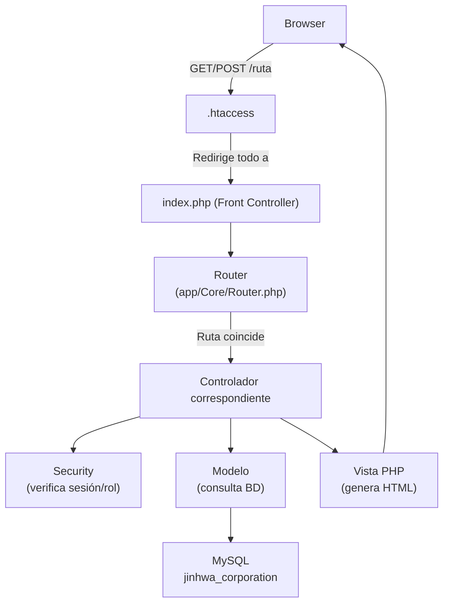

# Documentación de la Aplicación – Jinhwan Corporation

## ¿Qué es esta aplicación?

Sistema de gestión para un **club de Taekwondo**. Permite administrar miembros, sedes, contenido teórico de ascensos y tiene un portal web público. Está desarrollado en **PHP puro** siguiendo el patrón **MVC** (Modelo–Vista–Controlador) sin usar frameworks externos.

---

## Arquitectura General



---

## Flujo de una Petición HTTP

1. El navegador solicita una URL (p. ej. `/admin/miembros`)
2. `.htaccess` redirige a `index.php` si no es un archivo/carpeta real
3. `index.php` carga todos los archivos y registra todas las rutas
4. `Router::dispatch()` compara la URL con las rutas registradas
5. Se instancia el controlador → el constructor ejecuta `Security::verifySession()` y `verifyAdmin()`
6. Si la seguridad pasa, el método del controlador consulta el modelo
7. El modelo ejecuta la consulta SQL y retorna los datos
8. El controlador llama a `$this->view()` que incluye el archivo PHP de vista
9. La vista genera el HTML que se envía al navegador

---

## Estructura de Archivos Comentados

### `app/Config/` – Configuración

| Archivo | Función |
|---------|---------|
| `Database.php` | Conexión MySQL con patrón Singleton. Una sola conexión por petición. |
| `Roles.php` | Constantes de roles: ADMINISTRADOR=1, MAESTRO=2, ESTUDIANTE=3 |

### `app/Core/` – Núcleo del Framework

| Archivo | Función |
|---------|---------|
| `Router.php` | Registra rutas GET/POST y despacha al controlador correcto |
| `Controller.php` | Clase base: métodos `view()` y `redirect()` |
| `Model.php` | Clase base: proporciona `$this->db` (conexión mysqli) |
| `Security.php` | Sesiones seguras: timeout 30min, User-Agent, regeneración ID, logout |

### `app/Helpers/` – Utilidades

| Archivo | Función |
|---------|---------|
| `url_helper.php` | Funciones `base_url()` y `asset()` para URLs independientes del servidor |

### `app/Models/` – Modelos (acceso a datos)

| Archivo | Tablas | Operaciones |
|---------|--------|-------------|
| `Usuario.php` | miembros + userlog + sedes + grados | getAllWithDetails, getById, create, update, delete |
| `Sede.php` | sedes | getAll, create, update, delete (con desvinculación segura) |
| `Nivel.php` | grados | getAll (solo lectura, catálogo) |
| `Teoria.php` | teoria | getAll, create, update, delete |

### `app/Controllers/` – Controladores

#### 🌐 Web (sitio público, sin autenticación)

| Controlador | Ruta | Vista |
|-------------|------|-------|
| `InicioController` | GET `/` y `/inicio` | web/portal, web/inicio |
| `PaginaController` | GET `/nosotros` | web/nosotros |
| `SedesController` | GET `/sedes` | web/sedes |
| `InstructoresController` | GET `/instructores` | web/instructores |
| `GaleriaController` | GET `/galeria` | web/galeria |

#### 🔐 Autenticación

| Controlador | Rutas | Función |
|-------------|-------|---------|
| `AutenticacionController` | GET `/login`, POST `/login/process` | Verificar credenciales + sesión segura |
| | GET `/registro`, POST `/registro/process` | Registro público (activo=0) |
| | GET `/logout` | Destruir sesión |

#### 👨‍🎓 Estudiante (requiere sesión activa)

| Controlador | Ruta | Función |
|-------------|------|---------|
| `DashboardController` | GET `/estudiante/dashboard` | Panel personal del alumno |
| `EstudioController` | GET `/estudiante/estudio` | Material teórico por cinturón |
| | POST `/ascensos/toggle` | Toggle favorito (endpoint AJAX, deshabilitado) |

#### ⚙️ Administración (requiere sesión + rol Admin)

| Controlador | Rutas | Función |
|-------------|-------|---------|
| `DashboardController` | GET `/admin/dashboard` | Panel con estadísticas del club |
| `MiembrosController` | `/admin/miembros` (CRUD) | Gestión completa de miembros |
| `SedesController` | `/admin/sedes` (CRUD) | Gestión de sedes |
| `AscensosController` | `/admin/ascensos` (CRUD) | Gestión del contenido teórico |
| `RegistrosController` | `/admin/registros` | Aprobar/rechazar solicitudes de registro |

---

## Sistema de Seguridad de Sesiones

`Security::verifySession()` aplica **6 capas de protección** en orden:

| # | Verificación | Acción si falla |
|---|-------------|-----------------|
| 1 | Existencia de `$_SESSION['id']` | Redirigir a `/login?error=no_session` |
| 2 | Inactividad > 30 minutos | Logout + `/login?error=timeout` |
| 3 | User-Agent cambiado (posible robo) | Logout + `/login?error=security` |
| 4 | Regenerar ID de sesión cada 30 min | Prevención de Session Fixation |
| 5 | Existencia de `login_time` | Logout + `/login?error=invalid` |
| 6 | Sesión absoluta > 8 horas | Logout + `/login?error=expired` |

---

## Flujo de Login

```
Usuario POST /login/process
  → Buscar correo en credenciales JOIN personas
  → Verificar contraseña: password_verify() con hash bcrypt
  → Verificar activo = 1 en personas
  → Security::startSecureSession() → guardar id_persona, nombre, correo, rol
  → Redirigir según rol:
      rol = 'Administracion' → /admin/dashboard
      rol = 'Maestros'       → /maestro/dashboard
      rol = 'Deportistas'    → /estudiante/dashboard
      otro                   → /
```

## Flujo de Registro Público

```
Usuario POST /registro/process
  → INSERT personas (activo = 0)  ← pendiente de aprobación
  → INSERT credenciales (id_persona, correo, clave = bcrypt, rol = 'Deportistas')
  → INSERT perfil_deportistas (id_persona, fecha_n, eps, rh, etc.)
  → Redirigir a /login?msg=sent
  
Admin en /admin/registros
  → Ver solicitudes (activo = 0)
  → Aprobar: UPDATE personas SET activo = 1 WHERE id_persona = ?
  → Rechazar: DELETE FROM personas WHERE id_persona = ? (ON DELETE CASCADE borra credenciales y perfil)
```

---

## Base de Datos

**Nombre:** `jinhwa_corporation`  
**Servidor:** MySQL en Laragon (localhost, usuario root, sin contraseña)

| Tabla | Descripción |
|-------|-------------|
| `personas` | Datos personales comunes (nombre, apellido, documento, teléfono, sede, foto, activo) |
| `credenciales` | Credenciales de acceso (correo, clave bcrypt, rol, permisos en formato JSON) |
| `perfil_deportistas` | Perfil técnico deportivo (grado, categoría, fecha nacimiento, peso, división, EPS, RH) |
| `perfil_maestros` | Perfil docente de los maestros (descripción, logros, visibilidad en web) |
| `sedes` | Sedes físicas del club (nombre, dirección, teléfono, horario) |
| `categorias` | Categorías por edades y modalidad (Pre-benjamín, Cadete, Junior, Mayores, etc.) |
| `grados` | Niveles y cinturones de Taekwondo (Blanco, Amarillo, Verde, Azul, Rojo, Dan, etc.) |
| `solicitudes_ascenso` | Solicitudes de ascenso de grado enviadas por deportistas y evaluadas por maestros |
| `eventos` | Eventos institucionales del club para el calendario |
| `noticias` | Publicaciones y avisos para el portal público |
| `tipos_teoria` | Categorización del contenido teórico (General, Poomses, etc.) |
| `teorias` | Material de estudio teórico y videos instructivos asociados a cada grado |
| `galeria_multimedia` | Enlaces e imágenes/videos multimedia del club |

